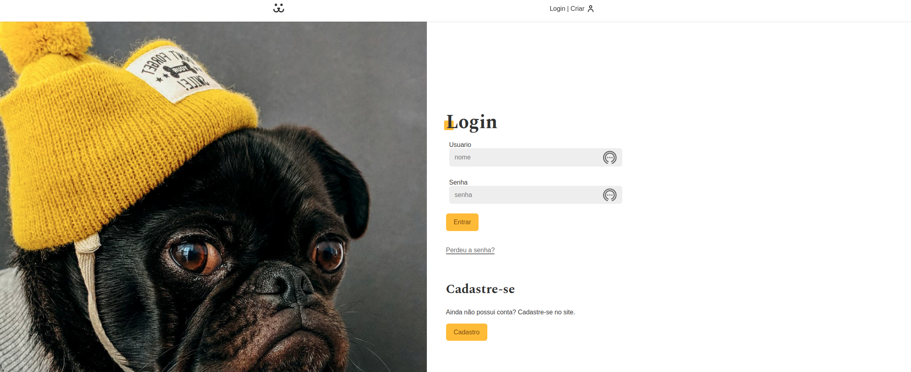
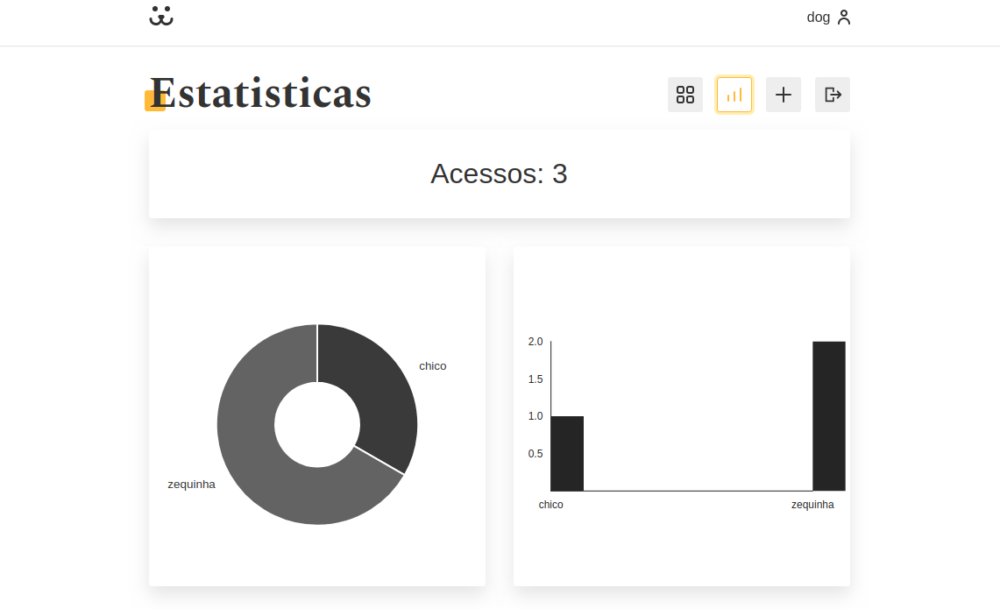

<div>
  <h1 align="center">DOGS</h1>
  
  <div align="center">

  <a href="#sobre">Sobre</a> 
    |
  <a href="#tecnologias">Tecnólogias</a>
    |
  <a href="#dependencias">Dependências</a>
    |
  <a href="#Projeto">Pagina do projeto</a>

  </div>
</div>

<div >
<ul align="center">
  
  
  
  
  
</ul>

</div>


<div>
  <h3>Sobre.</h3>
  <h4 id="sobre" > Projeto de rede social para Pets. Uma rede social voltada para donos de pets, onde os mesmo podem postar fotos, comentar e curtir outras postagens de usuarios que estão na mesma rede. Alem disso também é possível verificar as vizualizações em sua rede. </h4>

  

  

  
</div>


<div id="tecnologias">
  <h3>Tecnológias.</h3>
  <ul>
    <li>
      <a href="https://developer.mozilla.org/pt-BR/docs/Web/JavaScript">JavaScript.
      </a>
    </li>
    <li>
      <a href="https://developer.mozilla.org/pt-BR/docs/Web/CSS">CSS3.
      </a>
    </li>
    <li>
      <a href="https://developer.mozilla.org/pt-BR/docs/Web/HTML/HTML5">HTML5.
      </a>
    </li>
    <li>
      <a href="https://pt-br.reactjs.org/docs/getting-started.html">REACT.
      </a>
    </li>
    <li>
      <a href="https://nodejs.org/pt-br/docs/">
        NODE.JS.
      </a>
    </li>
    <li>
      <a href="https://classic.yarnpkg.com/en/docs/">
        YARN.
      </a>
    </li>
    <li>
      <a href="https://github.com/FormidableLabs/victory">
        VICTORY.
      </a>
    </li>

  </ul>
  
</div>

<div id="dependencias">
  <h3>Dependêcias.</h3>
    <p align="center">
      para utilizar da aplicação, será necessario fazer alguns procedimentos de instalção de pacotes
    </p>

```bash
# Clone this repository
$ git clone https://github.com/FullBarbosa/DOGS.git DOGS

# Install dependencies Yarn
$ yarn install

# Install dependencies NPM
$ npm install 

# Install React-Router-Dom 
$ yarn add react-router-dom

# npm i --save victory
$ yarn add victory
```
 </div>


<div id="Projeto">
  <h3>Projeto.</h3>
  <a href="https://dogs-teal.vercel.app/">
  
  </a>
</div>